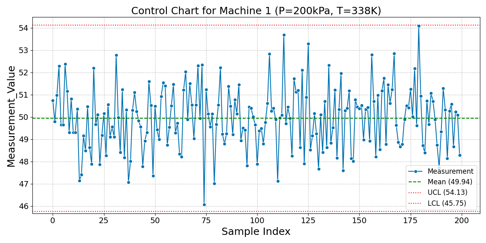
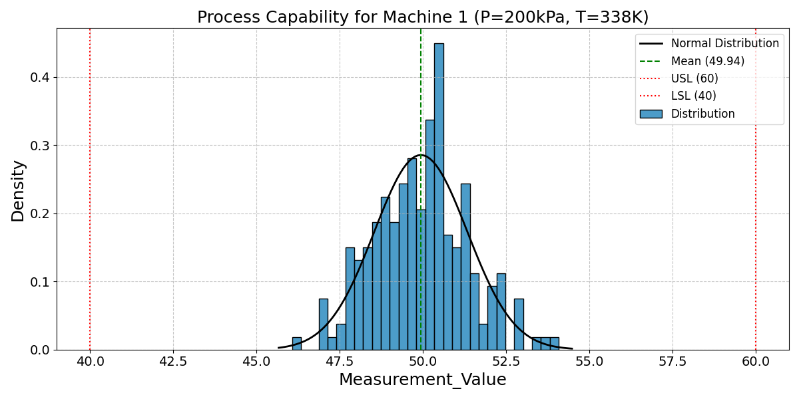
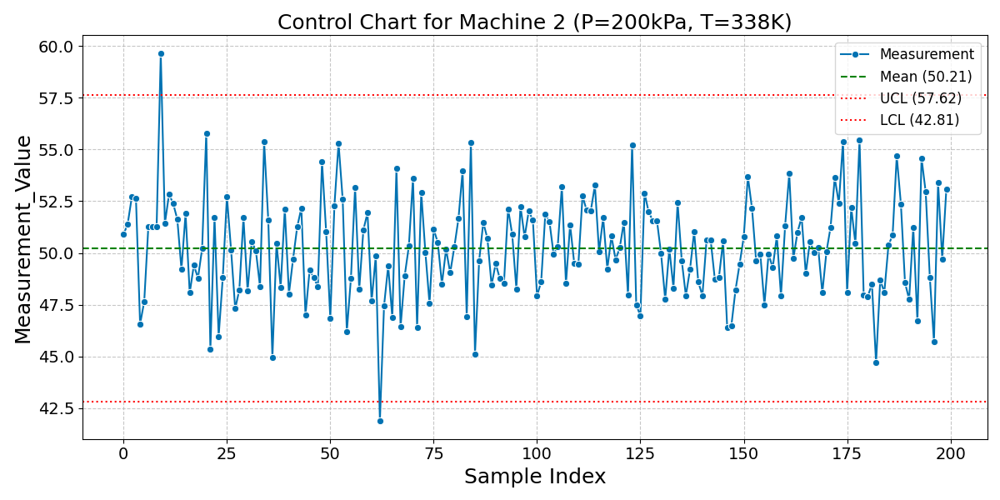
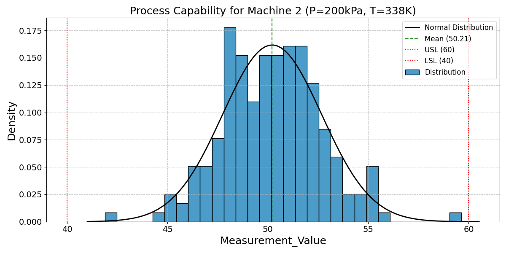
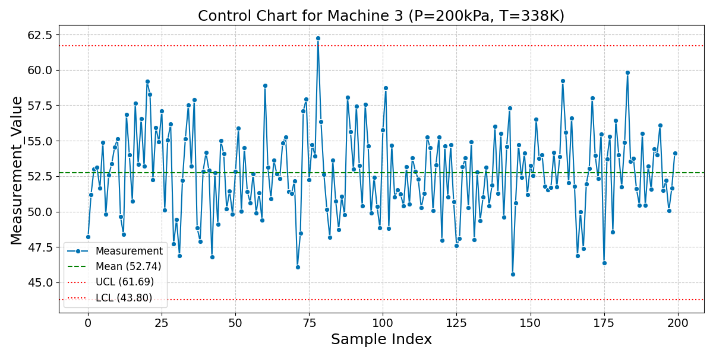
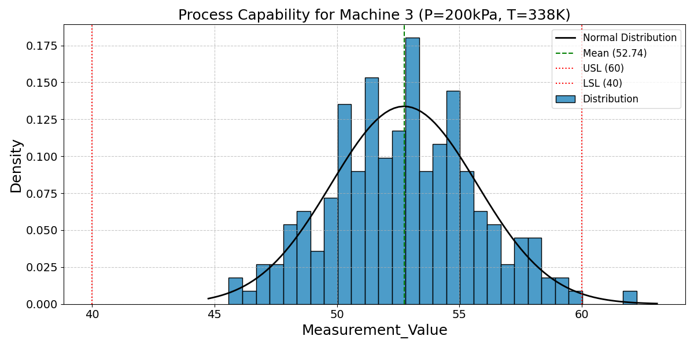
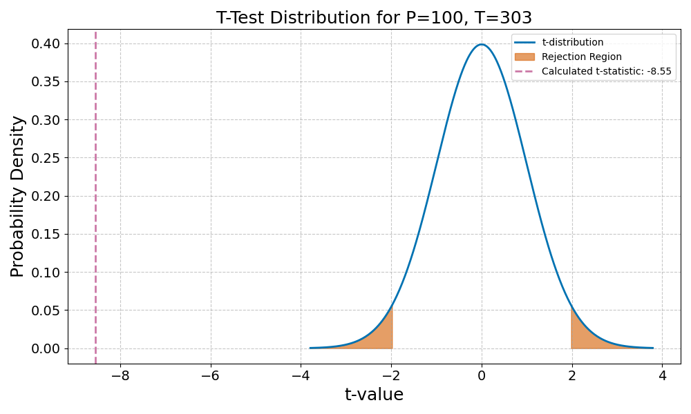
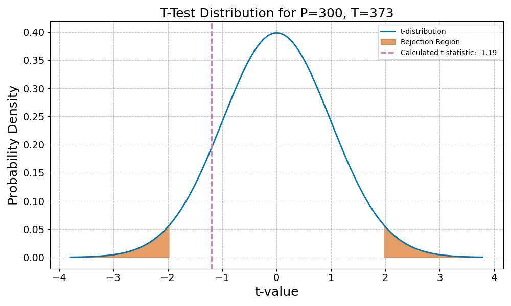
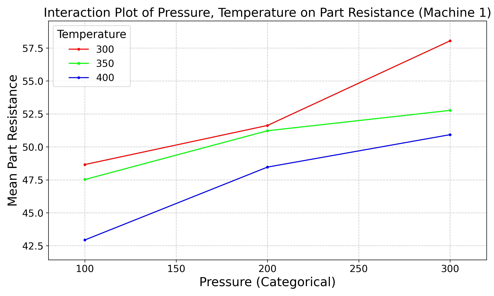

:::: {.columns}
::: {.column width="50%"}

## Sample slides
#### PlaceHolderName
#### Universiti Malaysia Perlis
#### [placeholder@email.com](mailto:placeholder@email.com)

<audio id="bg-music" src="media/audio/sb.m4a" loop></audio>

<div id="audio-credit"
     style="position: absolute; bottom: 40px; right: 20px; font-size: 0.6em; opacity: 0.6;">
  Music: “Adrift” by Scott Buckley (CC BY 4.0)
</div>

<script>
  document.addEventListener('DOMContentLoaded', () => {
    const audio = document.getElementById('bg-music');
    const credit = document.getElementById('audio-credit');

    // hide credit by default
    credit.style.display = 'none';

    const test = new Audio('media/audio/bgm.mp3');

    test.addEventListener('canplaythrough', () => {
      // bgm.mp3 exists → use it, keep credit hidden
      audio.src = 'media/audio/bgm.mp3';
    }, { once: true });

    test.addEventListener('error', () => {
      // bgm.mp3 missing → sb.m4a will play → show credit
      credit.style.display = 'block';
    }, { once: true });

    document.addEventListener('click', () => {
      if (Reveal.getIndices().h === 0) {
        audio.volume = 0.5;
        audio.play();
      }
    }, { once: true });

    Reveal.on('slidechanged', (event) => {
      if (event.indexh > 0) { audio.pause(); }
      else { audio.play(); }
    });
  });
</script>

:::

::: {.column width="50%"}

:::

::::

---

:::: {.columns}
::: {.column width="50%"}
### Slide one
**Key Concepts:**
- Energy conservation per @carnot1824.
- $\Delta U = Q - W$
:::

::: {.column width="50%"}

:::
::::

---

<span class="slide-title" data-title="My Hidden Slide Name"></span>


---

:::: {.columns}
::: {.column width="50%"}
### The Master Equation
The fundamental relation of thermodynamics:

$$\Delta U = Q - W$$

The work done $W$ is positive when the system expands against an external pressure.
:::

::: {.column width="50%"}
<video data-src="media/videos/sample.mp4" data-autoplay loop muted width="100%"></video>
:::

::::

---

:::: {.columns}
::: {.column width="50%"}
### Visualizing the Gas Law
**Interactive Model:**

- P, V, and T relationships.
- Use the slider to adjust pressure.
- Observe the phase boundary.
:::

::: {.column width="50%"}
<iframe 
  data-src="media/plots/sample.html" 
  width="100%" 
  height="500px" 
  style="border:none;" 
  scrolling="no">
</iframe>
:::
::::

---

# Bibliography
<div id="refs"></div>

---

:::: {.columns}
::: {.column width="50%"}
### Distribution of Age

This histogram visualizes the distribution of ages within the `bigclass` dataset.
:::

::: {.column width="50%"}
<iframe 
  data-src="media/plots/age_histogram.html" 
  width="100%" 
  height="500px" 
  style="border:none;" 
  scrolling="no">
</iframe>
:::
::::

---

:::: {.columns}
::: {.column width="50%"}
### Slide 1: Control Chart for Machine 1
This control chart visualizes the measurements from Machine 1 under specific conditions, indicating process stability over time.
:::

::: {.column width="50%"}

:::
::::

---

:::: {.columns}
::: {.column width="50%"}
### Slide 2: Process Capability for Machine 1
This histogram shows the distribution of measurements for Machine 1 relative to the Upper and Lower Specification Limits (USL/LSL), alongside a fitted normal distribution.
:::

::: {.column width="50%"}

:::
::::

---

:::: {.columns}
::: {.column width="50%"}
### Slide 3: Cpk Calculation for Machine 1
The Cpk value for Machine 1 under the specified conditions is calculated to assess its process capability.

```
Machine 1 Cpk: 2.37
```
:::

::: {.column width="50%"}
### Slide 4: Capability Assessment for Machine 1
Based on the calculated Cpk, the process capability of Machine 1 is:

```
The machine is capable under these conditions (Cpk >= 1.33).
```
:::
::::

---

:::: {.columns}
::: {.column width="50%"}
### Slide 5: Control Chart for Machine 2
This control chart visualizes the measurements from Machine 2 under specific conditions, indicating process stability over time.
:::

::: {.column width="50%"}

:::
::::

---

:::: {.columns}
::: {.column width="50%"}
### Slide 6: Process Capability for Machine 2
This histogram shows the distribution of measurements for Machine 2 relative to the Upper and Lower Specification Limits (USL/LSL), alongside a fitted normal distribution.
:::

::: {.column width="50%"}

:::
::::

---

:::: {.columns}
::: {.column width="50%"}
### Slide 7: Cpk Calculation for Machine 2
The Cpk value for Machine 2 under the specified conditions is calculated to assess its process capability.

```
Machine 2 Cpk: 1.32
```
:::

::: {.column width="50%"}
### Slide 8: Capability Assessment for Machine 2
Based on the calculated Cpk, the process capability of Machine 2 is:

```
The machine is NOT capable under these conditions (Cpk < 1.33).
```
:::
::::

---

:::: {.columns}
::: {.column width="50%"}
### Slide 9: Control Chart for Machine 3
This control chart visualizes the measurements from Machine 3 under specific conditions, indicating process stability over time.
:::

::: {.column width="50%"}

:::
::::

---

:::: {.columns}
::: {.column width="50%"}
### Slide 10: Process Capability for Machine 3
This histogram shows the distribution of measurements for Machine 3 relative to the Upper and Lower Specification Limits (USL/LSL), alongside a fitted normal distribution.
:::

::: {.column width="50%"}

:::
::::

---

:::: {.columns}
::: {.column width="50%"}
### Slide 11: Cpk Calculation for Machine 3
The Cpk value for Machine 3 under the specified conditions is calculated to assess its process capability.

```
Machine 3 Cpk: 0.81
```
:::

::: {.column width="50%"}
### Slide 12: Capability Assessment for Machine 3
Based on the calculated Cpk, the process capability of Machine 3 is:

```
The machine is NOT capable under these conditions (Cpk < 1.33).
```
:::
::::

---

:::: {.columns}
::: {.column width="50%"}
### Slide 13: T-Test Distribution Curve (P=100, T=303)
This t-distribution curve visualizes the results of the independent two-sample t-test comparing Machine 1 and Machine 2 measurements under Pressure=100, Temperature=303. The calculated t-statistic is marked, along with the critical rejection regions for an alpha level of 0.05.
:::

::: {.column width="50%"}

:::
::::

---

:::: {.columns}
::: {.column width="50%"}
### Slide 14: T-Test Results (P=100, T=303)
This slide presents the calculated t-statistic and p-value from the independent two-sample t-test comparing Machine 1 and Machine 2 measurements under Pressure=100, Temperature=303.

```
T-statistic: -8.5515
P-value: 0.0000
```
:::

::: {.column width="50%"}
### Key Statistical Values
- **Degrees of Freedom (Welch's):** 197.53
- **Significance Level (alpha):** 0.05
- **Critical t-values:** (-1.97, 1.97)
:::
::::

---

:::: {.columns}
::: {.column width="50%"}
### Slide 15: Is there a true difference? (P=100, T=303)
Based on the t-test analysis with an alpha level of 0.05, we assess whether there is a statistically significant difference between the measurements of Machine 1 and Machine 2 under these conditions.

```
Is there a true difference?: Yes
```
:::

::: {.column width="50%"}
### Conclusion Summary
The p-value is less than the significance level (alpha = 0.05), indicating a statistically significant difference between the measurements of Machine 1 and Machine 2 under these conditions.
:::
::::

---

:::: {.columns}
::: {.column width="50%"}
### Slide 16: T-Test Distribution Curve (P=300, T=373)
This t-distribution curve visualizes the results of the independent two-sample t-test comparing Machine 1 and Machine 2 measurements under Pressure=300, Temperature=373. The calculated t-statistic is marked, along with the critical rejection regions for an alpha level of 0.05.
:::

::: {.column width="50%"}

:::
::::

---

:::: {.columns}
::: {.column width="50%"}
### Slide 17: T-Test Results (P=300, T=373)
This slide presents the calculated t-statistic and p-value from the independent two-sample t-test comparing Machine 1 and Machine 2 measurements under Pressure=300, Temperature=373.

```
T-statistic: -1.1933
P-value: 0.2342
```
:::

::: {.column width="50%"}
### Key Statistical Values
- **Degrees of Freedom (Welch's):** 190.29
- **Significance Level (alpha):** 0.05
- **Critical t-values:** (-1.97, 1.97)
:::
::::

---

:::: {.columns}
::: {.column width="50%"}
### Slide 18: Is there a true difference? (P=300, T=373)
Based on the t-test analysis with an alpha level of 0.05, we assess whether there is a statistically significant difference between the measurements of Machine 1 and Machine 2 under these conditions.

```
Is there a true difference?: No
```
:::

::: {.column width="50%"}
### Conclusion Summary
The p-value is greater than or equal to the significance level (alpha = 0.05), indicating no statistically significant difference between the measurements of Machine 1 and Machine 2 under these conditions.
:::
::::
---

:::: {.columns}
::: {.column width="50%"}
### Slide 19: Display ANOVA Table / Pr(>F) for Pressure (P)
This table shows the ANOVA results focusing on the effect of Pressure (P) on Machine 1's Part Resistance.

```
               sum_sq     df         F  PR(>F)
C(Pressure) 4271.7138 2.0000 1000.4056  0.0000
```
:::

::: {.column width="50%"}
### Text evaluation: Is this factor, Pressure (P) significant for Machine 1?

```
Is Pressure (P) significant?: Yes
```
### Conclusion Summary
The p-value (Pr(>F)) for Pressure (P) is 0.0000.
As this is less than the significance level (alpha = 0.05), it indicates a statistically significant effect.
:::
::::
---

:::: {.columns}
::: {.column width="50%"}
### Slide 20: Display ANOVA Table / Pr(>F) for Temperature (T)
This table shows the ANOVA results focusing on the effect of Temperature (T) on Machine 1's Part Resistance.

```
                  sum_sq     df        F  PR(>F)
C(Temperature) 2148.9751 2.0000 503.2750  0.0000
```
:::

::: {.column width="50%"}
### Text evaluation: Is this factor, Temperature (T) significant for Machine 1?

```
Is Temperature (T) significant?: Yes
```
### Conclusion Summary
The p-value (Pr(>F)) for Temperature (T) is 0.0000.
As this is less than the significance level (alpha = 0.05), it indicates a statistically significant effect.
:::
::::
---

:::: {.columns}
::: {.column width="50%"}
### Slide 21: Display ANOVA Table / Pr(>F) for Pressure*Temperature (P*T) Interaction
This table shows the ANOVA results focusing on the effect of Pressure*Temperature (P*T) Interaction on Machine 1's Part Resistance.

```
                             sum_sq     df       F  PR(>F)
C(Pressure):C(Temperature) 429.9690 4.0000 50.3479  0.0000
```
:::

::: {.column width="50%"}
### Text evaluation: Is this factor, Pressure*Temperature (P*T) Interaction significant for Machine 1?

```
Is Pressure*Temperature (P*T) Interaction significant?: Yes
```
### Conclusion Summary
The p-value (Pr(>F)) for Pressure*Temperature (P*T) Interaction is 0.0000.
As this is less than the significance level (alpha = 0.05), it indicates a statistically significant effect.
:::
::::
---

:::: {.columns}
::: {.column width="50%"}
### Slide 22: Interaction Plot for Machine 1 Resistance
This interaction plot visualizes the relationship between Pressure and Temperature on Machine 1's Part Resistance. It helps to understand if the effect of one factor depends on the level of the other factor, showing how the mean response changes across different factor combinations.
:::

::: {.column width="50%"}

:::
::::
